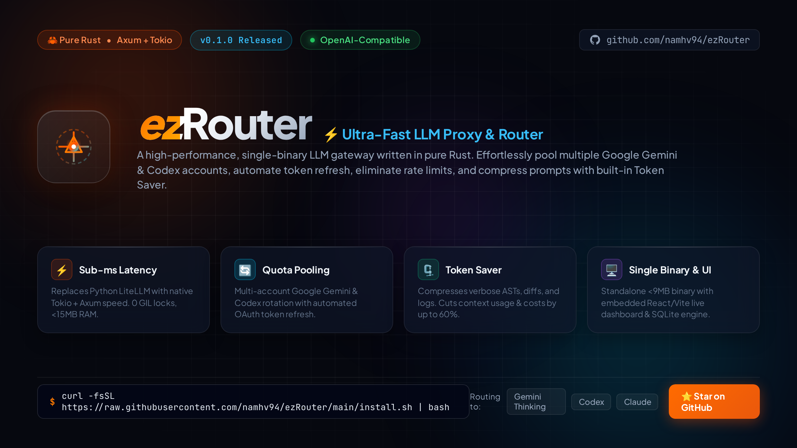
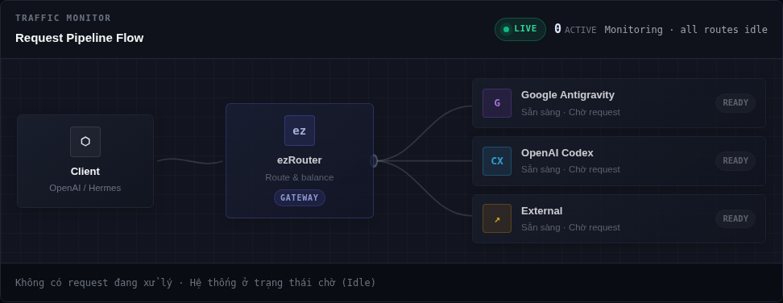
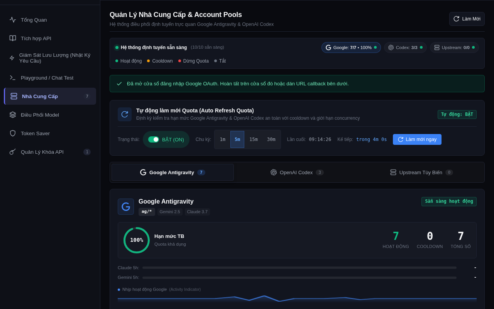

<div align="center">

<p align="center">
  
</p>

# ⚡ ezRouter

**High-Performance, Memory-Safe LLM Proxy & Intelligent Router written in Rust**

[](https://www.rust-lang.org/)
[](https://github.com/tokio-rs/axum)
[](#-openai-compatible-api)
[](#option-b-docker--docker-compose)
[](#-embedded-web-management-console)
[](https://www.buymeacoffee.com/namhv94)
[](LICENSE)

<p align="center">
  <a href="#-key-features"><b>Features</b></a> •
  <a href="#-architecture"><b>Architecture</b></a> •
  <a href="#-quick-start"><b>Quick Start</b></a> •
  <a href="#-supported-providers--models"><b>Models</b></a> •
  <a href="#-token-saver-engine"><b>Token Saver</b></a> •
  <a href="#-embedded-web-management-console"><b>Dashboard</b></a> •
  <a href="#-configuration"><b>Configuration</b></a> •
  <a href="#-performance--benchmarks"><b>Benchmarks</b></a> •
  <a href="#-support-the-project"><b>Support</b></a>
</p>

---

</div>

## 📌 Overview

**ezRouter** is an ultra-fast, memory-safe LLM proxy & router designed for modern AI applications. Written from the ground up in 100% pure Rust, ezRouter acts as a unified OpenAI-compatible gateway that aggregates and optimizes upstream AI providers with **sub-millisecond local routing latency**, **multi-account quota rotation**, and **smart real-time prompt compression**.

Whether you are orchestrating high-concurrency coding agents (Hermes, Claude Code, Cursor, OpenCode), running RAG pipelines, or balancing requests across multi-account Google Gemini and OpenAI tiers, ezRouter eliminates rate-limit bottlenecks and cuts token costs with zero operational overhead.

---

## ✨ Key Features

- ⚡ **Sub-Millisecond Routing Overhead:** Built on Tokio and Axum 0.7. Zero Python runtimes, zero garbage collection pauses, minimal memory footprint (**< 25MB RAM idle**).
- 🔄 **Multi-Account Quota Pooling:**
  - **Google Antigravity:** Multi-account OAuth pool with automatic background token refreshes, rate-limit cooldowns, and real-time quota telemetry.
  - **OpenAI Codex:** PKCE OAuth multi-account pool with quota reset countdowns and proactive account rotation.
  - **Custom Providers:** Flexible passthrough for DeepSeek, Groq, Ollama, OpenRouter, vLLM, and internal private models.
- 🛡️ **Smart Circuit Breaking & Instant Failover:**
  - Real-time HTTP 429 (rate-limit) and 5xx detection.
  - Instant transparent retries across fallback chains without disconnecting or stalling the client.
- 🗜️ **Token Saver Engine:**
  - Native prompt compression pipeline (**RTK**, **Caveman**, **Ponytail**) that trims repetitive whitespace, redundant system boilerplate, and verbose AST tokens—**saving 30% to 60% token usage** while preserving model reasoning quality.
- 🔌 **100% OpenAI Drop-In Compatibility:**
  - Chat completions (`POST /v1/chat/completions`) with full Server-Sent Events (SSE) streaming and tool call fidelity.
  - Model catalog (`GET /v1/models`, `GET /v1/models/:id`).
  - Text embeddings (`POST /v1/embeddings`) for vector databases and Mem0 / RAG workflows.
  - Image generation (`POST /v1/images/generations`).
- 🎛️ **Combo & Virtual Routing:**
  - Bundle multiple physical models into unified virtual endpoints with round-robin, weighted, or priority fallback strategies.
- 🖥️ **Embedded Dark-Mode Web Console:**
  - Modern React + TypeScript + Vite management dashboard bundled directly inside the standalone binary.
  - Real-time pipeline inspect, traffic metrics, API key management, and full bilingual support (**Tiếng Việt / English**).
- 🔒 **Enterprise-Grade Privacy & Security:**
  - Sensitive tokens, credentials, and API keys are strictly redacted and masked in logs, SQLite database records, and UI views.
  - Zero telemetry or external tracking.

---

## 🏛️ Architecture

```text
       ┌─────────────────────────────────────────────────────────────┐
       │   Clients (Hermes Agent, Claude Code, Cursor, Python/Node)  │
       └──────────────────────────────┬──────────────────────────────┘
                                      │ OpenAI API (/v1/*)
                                      ▼
       ┌─────────────────────────────────────────────────────────────┐
       │                      ezRouter (Rust Core)                   │
       │                                                             │
       │  ┌──────────────────────┐        ┌───────────────────────┐  │
       │  │ Token Saver (AST/RTK)│        │ Quota Manager & Pool  │  │
       │  └──────────┬───────────┘        └───────────┬───────────┘  │
       │             ▼                                ▼              │
       │  ┌──────────────────────┐        ┌───────────────────────┐  │
       │  │ Smart Failover Engine│◄──────►│ SQLite State Engine   │  │
       │  └──────────────────────┘        └───────────────────────┘  │
       │  ┌───────────────────────────────────────────────────────┐  │
       │  │      Self-Hosted Embedded Web Console (React/Vite)    │  │
       │  └───────────────────────────────────────────────────────┘  │
       └──────────────────────────────┬──────────────────────────────┘
                                      │
         ┌────────────────────────────┼────────────────────────────┐
         ▼                            ▼                            ▼
  Google Antigravity            OpenAI Codex                Custom Providers
  (Gemini 2.5 / 3.0 / 3.8)    (GPT-5 / 6.1 / Codex)      (DeepSeek, Groq, Ollama)
```

---

## 🚀 Quick Start

### Option A: 1-Line Quick Install (Linux x86_64)

```bash
curl -fsSL https://raw.githubusercontent.com/namhv94/ezRouter/main/install.sh | bash
ezrouter
```

### Option B: Docker / Docker Compose

Run directly with Docker:

```bash
docker run -d \
  --name ezrouter \
  -p 20229:20229 \
  -v ezrouter_data:/data \
  -e AG_HOST=0.0.0.0 \
  -e AG_PORT=20229 \
  -e AG_DATA_DIR=/data \
  -e AG_API_KEY=your-admin-master-key \
  ghcr.io/namhv94/ezrouter:latest
```

Or clone and start using Docker Compose:

```bash
git clone https://github.com/namhv94/ezRouter.git
cd ezRouter
docker compose up -d
```

### Option C: Build from Source (Cargo)

Prerequisites: [Rust 1.75+](https://www.rust-lang.org/tools/install) installed.

```bash
git clone https://github.com/namhv94/ezRouter.git
cd ezRouter

# Copy example environment configuration
cp .env.example .env

# Build optimized release binary
cargo build --release

# Run ezRouter
./target/release/ezrouter
```

Once running, verify health:

```bash
curl http://127.0.0.1:20229/health
```

Access the built-in management console at **`http://127.0.0.1:20229/`**.

---

## 📦 Supported Providers & Models

ezRouter provides unified routing with structured model naming conventions:

| Namespace / Provider | Example Model IDs | Characteristics |
|---|---|---|
| **Google Antigravity** | `ag/gemini-2.5-flash`<br>`ag/gemini-3.0-flash`<br>`ag/gemini-3.8-flash-high`<br>`ag/gemini-3.0-pro` | Multi-account OAuth rotation, auto-refresh tokens, generous rate quotas. |
| **OpenAI Codex** | `cx/gpt-5`<br>`cx/gpt-6.1`<br>`cx/gpt-5-codex` | PKCE OAuth authentication, quota reset countdown, intelligent cooldown. |
| **Anthropic Claude** | `claude-3-5-sonnet`<br>`claude-opus-5.5`<br>`claude-sonnet-5.5` | Dynamic account feature routing, tool-calling optimizations. |
| **Custom Providers** | `deepseek-chat`<br>`deepseek-coder`<br>`llama-3.3-70b` | Pass-through to Groq, DeepSeek, Ollama, vLLM, OpenRouter, or private nodes. |
| **Combo / Virtual** | User-defined combos (e.g., `smart-fallback`) | Multi-tier failover chains (e.g. Try Gemini 3.8 → Fallback to GPT-5 on 429). |

---

## 💻 Client Integration

ezRouter works seamlessly with any tool or SDK built for the OpenAI API:

- **Base URL:** `http://127.0.0.1:20229/v1`
- **API Key:** Your configured master key (`AG_API_KEY`) or keys created in the Web Console.

### 🐍 Python (OpenAI SDK)

```python
from openai import OpenAI

client = OpenAI(
    base_url="http://127.0.0.1:20229/v1",
    api_key="your-ezrouter-key"
)

response = client.chat.completions.create(
    model="ag/gemini-3.8-flash-high",
    messages=[
        {"role": "system", "content": "You are a concise engineering assistant."},
        {"role": "user", "content": "Why is Rust optimal for network proxies?"}
    ],
    stream=True
)

for chunk in response:
    content = chunk.choices[0].delta.content or ""
    print(content, end="", flush=True)
print()
```

### ⚡ cURL

```bash
# Chat Completion (Streaming)
curl http://127.0.0.1:20229/v1/chat/completions \
  -H "Authorization: Bearer your-ezrouter-key" \
  -H "Content-Type: application/json" \
  -d '{
    "model": "ag/gemini-3.8-flash-high",
    "messages": [{"role": "user", "content": "Hello ezRouter!"}],
    "stream": true
  }'

# Text Embeddings (for Mem0 or vector search)
curl http://127.0.0.1:20229/v1/embeddings \
  -H "Authorization: Bearer your-ezrouter-key" \
  -H "Content-Type: application/json" \
  -d '{
    "model": "text-embedding-3-small",
    "input": "High-performance LLM routing in Rust"
  }'
```

### 🤖 Hermes Agent (`config.yaml`)

```yaml
model:
  default: "ag/gemini-3.8-flash-high"
  providers:
    ezrouter:
      base_url: "http://127.0.0.1:20229/v1"
      api_key: "your-ezrouter-key"
```

### 💻 Claude Code / Cursor / Continue

Point the OpenAI compatible base URL to `http://127.0.0.1:20229/v1` and supply your ezRouter API key.

---

## 🗜️ Token Saver Engine

LLM contexts often become bloated with redundant whitespace, repetitive system messages, and excessive JSON syntax. ezRouter features a built-in **Token Saver Engine** operating directly in the request pipeline:

| Mode | Target Use Case | Token Reduction |
|---|---|---|
| **RTK (Real-Time Kernel)** | Code AST, diff blocks, and repetitive syntax pruning | **30% – 45%** |
| **Caveman** | System prompt & repetitive persona compression | **25% – 40%** |
| **Ponytail** | Aggressive context tail pruning for long conversations | **40% – 60%** |

*All compression runs in microseconds in native Rust before the payload is forwarded to upstream providers.*

---

## 🖥️ Embedded Web Management Console

ezRouter includes a production-ready, dark-themed responsive web console embedded directly inside the compiled binary. No external web server, Node.js runtime, or static directory is needed in production.

### Live Request Pipeline Flow
<p align="center">
  
</p>

### Provider Quotas & Accounts Management
<p align="center">
  
</p>

- **Real-Time Traffic Inspection:** Monitor active requests, streaming latencies, and token counts.
- **Account Pool Health:** Track remaining daily quotas, reset timers, and error rates per account.
- **Bilingual Interface (i18n):** Instant switching between **Vietnamese** and **English** with persistent preferences.
- **Mobile-First Responsive Design:** Fully optimized drawer navigation and clean layout on screens as narrow as 390px.

---

## ⚙️ Configuration

Configuration is managed via environment variables or a local `.env` file:

### Core Server Settings

| Variable | Default | Description |
|---|---|---|
| `AG_HOST` | `127.0.0.1` | Network interface to bind (`0.0.0.0` for all interfaces) |
| `AG_PORT` | `20229` | Port to listen on (default: `20229`) |
| `AG_DATA_DIR` | `./data` | Directory for SQLite database and account configs |
| `AG_API_KEY` | `ag-proxy-key` | Master admin API key |
| `RUST_LOG` | `ezrouter=info,tower_http=info` | Tracing and log filter levels |
| `EZ_ALLOWED_DOMAINS` | `unset` | Comma-separated list of allowed CORS / OAuth origins |

### OAuth & Security Settings

| Variable | Default | Description |
|---|---|---|
| `AG_OAUTH_REDIRECT_URI` | `http://localhost:20229/auth/callback` | OAuth redirect URI for Google account authentication |
| `AG_GOOGLE_CLIENT_ID` | `unset` | Google OAuth Client ID |
| `AG_GOOGLE_CLIENT_SECRET` | `unset` | Google OAuth Client Secret |

### Upstream Timeouts & Retries

| Variable | Default | Description |
|---|---|---|
| `AG_UPSTREAM_CONNECT_TIMEOUT_SECS` | `10` | Maximum seconds allowed to establish upstream connection |
| `AG_UPSTREAM_READ_TIMEOUT_SECS` | `60` | Stream read chunk timeout in seconds |
| `AG_UPSTREAM_REQUEST_TIMEOUT_SECS` | `120` | Total request timeout limit in seconds |

---

## 📊 Performance & Benchmarks

Compared to traditional Python-based proxies (such as LiteLLM, One-API, or FastAPI gateways):

| Metric | Python Gateway (LiteLLM / FastAPI) | ezRouter (Rust) | Advantage |
|---|---|---|---|
| **Routing Overhead** | 12ms – 45ms | **< 0.5ms** | **20x–90x Faster** |
| **Idle Memory Footprint** | ~180MB – 350MB | **< 25MB** | **10x Lighter** |
| **Concurrency Ceiling** | Bound by GIL / Python Event Loop | **Multi-threaded Work-Stealing (Tokio)** | High Concurrency |
| **Deployment Footprint** | Multi-file virtualenv + pip deps | **Single self-contained ~15MB binary** | Zero dependencies |
| **Crash Safety** | Runtime uncaught exceptions | **Compile-time memory safety & strict typing** | Rock solid |

---

## 🛠️ Production Deployment (systemd)

For long-running Linux servers, set up ezRouter as a systemd service:

```bash
# 1. Build and copy release binary
cargo build --release
sudo cp target/release/ezrouter /usr/local/bin/

# 2. Install service unit
sudo cp deploy/ezrouter.service.example /etc/systemd/system/ezrouter.service

# 3. Reload and start
sudo systemctl daemon-reload
sudo systemctl enable --now ezrouter
sudo systemctl status ezrouter
```

---

## ☕ Support the Project

If **ezRouter** has saved you tokens, boosted your development speed, or simplified your LLM infrastructure, please consider supporting the project!

<p align="center">
  <a href="https://www.buymeacoffee.com/namhv94" target="_blank">
    
  </a>
</p>

Every coffee helps keep the project alive and fuels continuous open-source improvements. Thank you!

---

## 🤝 Contributing

Contributions are warmly welcome! Whether you are reporting an issue, proposing an optimization, or submitting a PR:

1. Fork the repository & clone your fork.
2. Create a feature branch: `git checkout -b feat/my-new-feature`
3. Run code checks:
   ```bash
   cargo fmt --check
   cargo clippy -- -D warnings
   cargo test
   ```
4. Commit your changes: `git commit -am 'feat: add amazing feature'`
5. Push to the branch: `git push origin feat/my-new-feature`
6. Open a Pull Request on GitHub.

---

## 📄 License

This project is open-source software licensed under the **[MIT License](LICENSE)**.
Distributed freely for personal, open-source, and commercial AI workloads.

<div align="center">
  <sub>Built with ❤️ and Rust by <a href="https://github.com/namhv94">NamHV</a> and open-source contributors.</sub>
</div>
